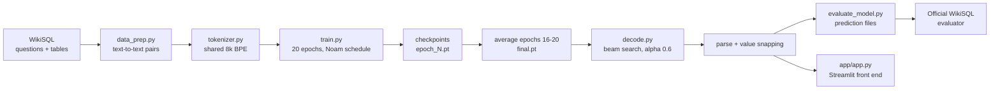
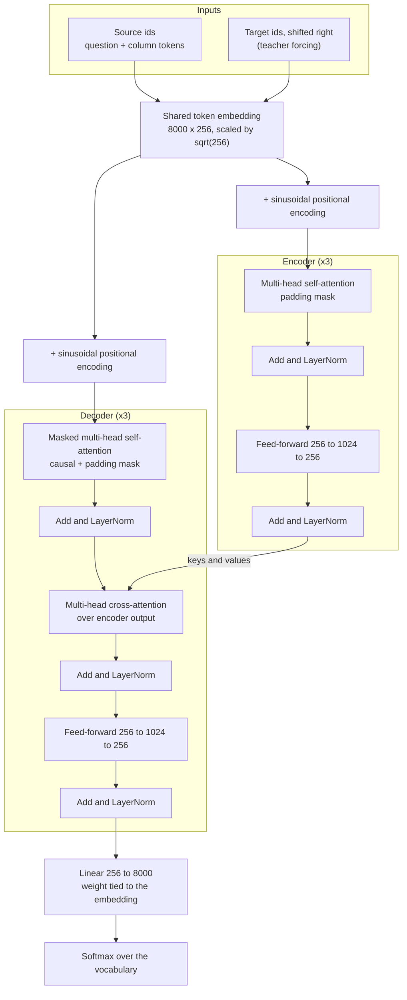
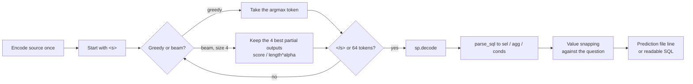
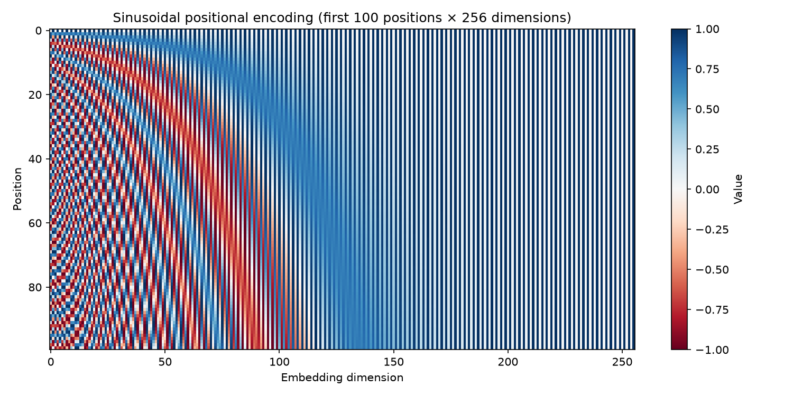
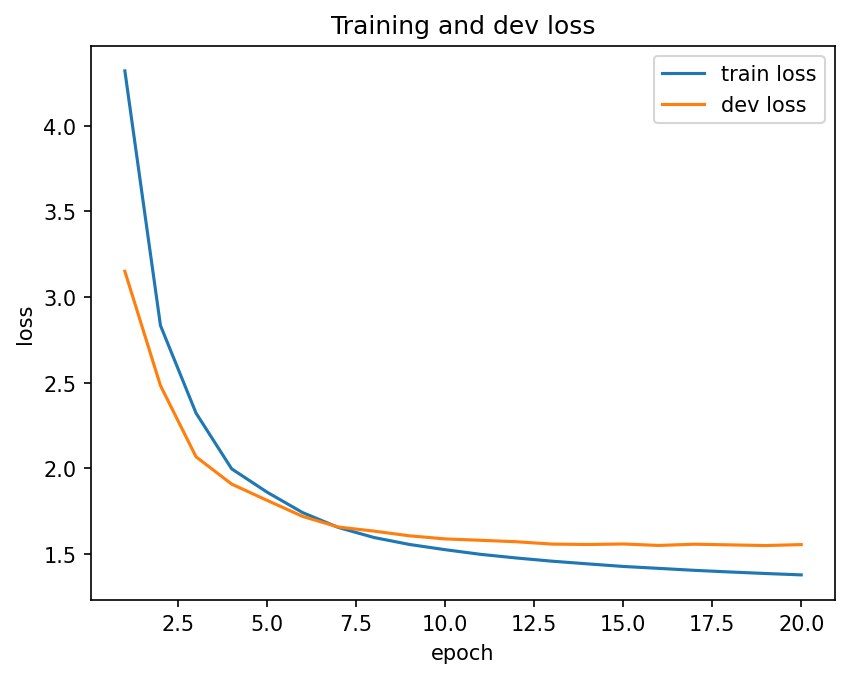
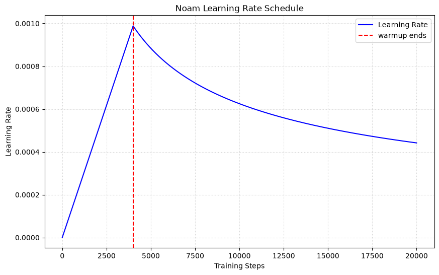
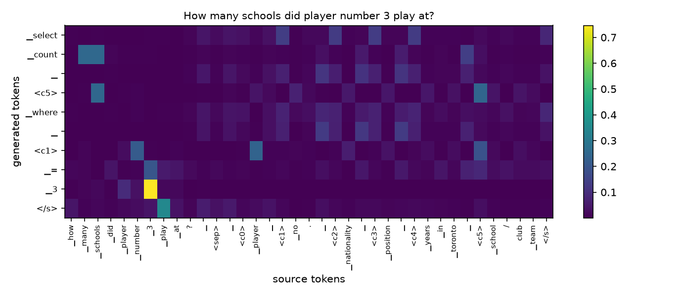
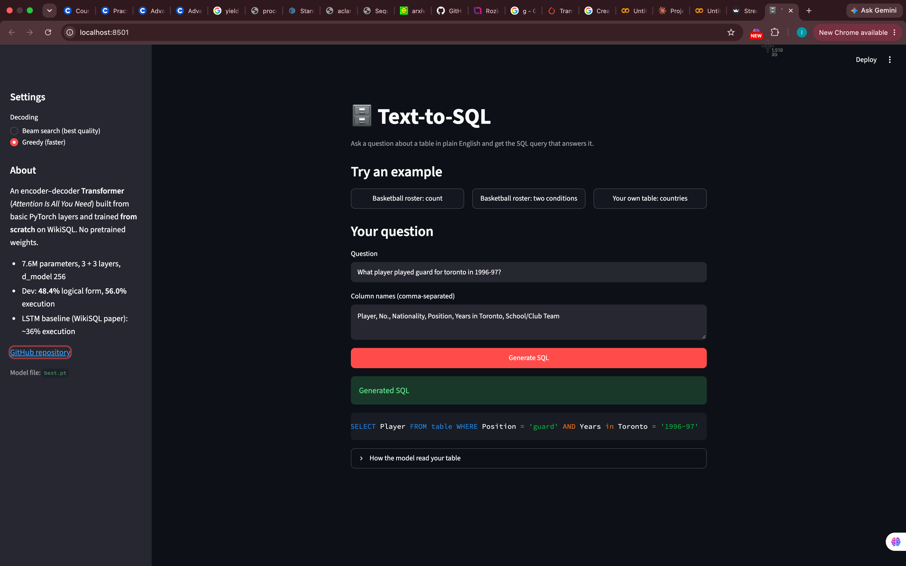

# Text-to-SQL with a Transformer built from scratch

Turn an English question about a table into the SQL query that answers it, using the encoder–decoder Transformer from *Attention Is All You Need* (Vaswani et al., 2017), implemented from basic PyTorch layers and trained from random initialisation on WikiSQL.

**Live demo:** TBD  |  **Medium blog:** TBD  |  **LinkedIn post:** TBD
**Team:** Kulsoom · Mobeen

| Input | Output |
|---|---|
| Question: *What player played guard for toronto in 1996-97?*<br>Columns: Player, No., Nationality, Position, Years in Toronto, School/Club Team | `SELECT Player FROM table WHERE Position = 'guard' AND Years in Toronto = '1996-97'` |

### Results at a glance

| Split | Logical form | Execution | Parse failures |
|---|---|---|---|
| Dev | **48.39%** | **55.97%** | 1.01% |
| Test | TBD | TBD | TBD |

Final setup: average of the epoch 16–20 checkpoints, beam search (size 4, length penalty α = 0.6), and value snapping. The original LSTM sequence-to-sequence baseline from the WikiSQL paper reaches about 36% execution accuracy; our model, trained from scratch with no pretrained weights, is about 20 points above it on dev.

---

## Contents

1. [How it works](#how-it-works)
2. [Architecture](#architecture)
3. [Repository layout](#repository-layout)
4. [Setup](#setup)
5. [Reproduce everything](#reproduce-everything)
6. [Results](#results)
7. [Correctness checks](#correctness-checks)
8. [Value snapping](#value-snapping)
9. [Front end](#front-end)
10. [Team](#team)
11. [References](#references)

---

## How it works

Every WikiSQL query has the same shape:

```
SELECT [agg] col FROM table [WHERE col op value (AND col op value)*]
```

with `agg` ∈ {none, MAX, MIN, COUNT, SUM, AVG} and `op` ∈ {=, >, <}.

The starter code turns each example into a plain text-to-text pair. Columns are replaced by special tokens `<c0>, <c1>, …`, so the model never has to spell a column name. It only has to point at the right one.

```
Source: what is terrence ross' nationality <sep> <c0> player <c1> no. <c2> nationality <c3> position ...
Target: select <c2> where <c0> = terrence ross
```

Source and target share one 8,000-piece BPE vocabulary, so the encoder embedding, the decoder embedding and the output projection share a single weight matrix.



---

## Architecture

The original Transformer, built from `nn.Linear`, `nn.Embedding`, `nn.LayerNorm`, `nn.Dropout`, `nn.ReLU`, `torch.softmax` and `torch.matmul`. No `nn.Transformer`, `nn.MultiheadAttention`, `F.scaled_dot_product_attention`, Hugging Face, or pretrained weights anywhere.



### Configuration

| Setting | Value |
|---|---|
| d_model | 256 |
| Heads h | 4 (d_k = d_v = 64) |
| Encoder / decoder layers | 3 / 3 |
| Feed-forward inner size d_ff | 1024 |
| Dropout | 0.1 |
| Normalisation | post-norm, LayerNorm(x + Sublayer(x)) |
| Weight sharing | encoder embedding = decoder embedding = output projection |
| Initialisation | Xavier-uniform for weight matrices; embedding N(0, d_model^-0.5) with the pad row zeroed |
| Trainable parameters | **7,577,600** |

Parameter breakdown: shared embedding 2,048,000 + encoder 3 × 789,760 + decoder 3 × 1,053,440. The output projection reuses the embedding matrix, so it adds nothing.

### Training

| Setting | Value |
|---|---|
| Teacher forcing | decoder input `tgt[:, :-1]`, target `tgt[:, 1:]` |
| Loss | cross-entropy, label smoothing 0.1, `<pad>` ignored |
| Optimiser | Adam, β1 = 0.9, β2 = 0.98, ε = 1e-9 |
| Learning rate | d_model^-0.5 · min(step^-0.5, step · 4000^-1.5) |
| Batch size / epochs | 64 / 20 |
| Checkpoint selection | lowest dev loss (`best.pt`, epoch 19) |
| Final weights | average of the epoch 16–20 checkpoints (`final.pt`), as the paper does for its base model |

The dev set was used only to choose the checkpoint and the decoding settings; the test set was used once, at the end.

### Decoding



---

## Repository layout

```
text-to-sql-transformer/
├── starter/              # given files, unchanged: data_prep, tokenizer, dataset, embeddings, check_starter
│   └── sql_sp.model      # the shared BPE tokenizer (committed; never retrained)
├── model/
│   ├── attention.py      # scaled dot-product + multi-head attention
│   ├── layers.py         # feed-forward, encoder layer/stack, decoder layer/stack
│   └── transformer.py    # padding/causal masks and the full model
├── data_stats.py         # Task 1: token-length statistics and positional-encoding heat-map
├── train.py              # Task 3: training loop, Noam schedule, checkpoints, resume
├── decode.py             # Task 4: greedy, beam search, parser, readable SQL, value snapping
├── evaluate_model.py     # Task 5: prediction files, official evaluator, components, attention map, samples
├── app/app.py            # Task 6: Streamlit front end
├── checkpoints/          # model weights (not committed except final.pt)
├── results/              # prediction files, figures, samples.md, train_log.json
├── requirements.txt
└── README.md
```

---

## Setup

Tested with Python 3.11.

```bash
git clone https://github.com/KayTheCoder-101/text-to-sql-transformer.git
cd text-to-sql-transformer
python3.11 -m venv venv
source venv/bin/activate          # Windows: venv\Scripts\activate
pip install -r requirements.txt
```

> **Intel Mac:** PyTorch stopped publishing Intel-Mac builds after 2.2. Use Python 3.11 and
> `pip install torch==2.2.2 "numpy<2"`, and keep `numpy<2` when installing anything else.

Get WikiSQL and build the text pairs:

```bash
git clone https://github.com/salesforce/WikiSQL
cd WikiSQL && tar xjf data.tar.bz2 && cd ..
cd starter && ln -s ../WikiSQL WikiSQL && python data_prep.py && cd ..
```

Do **not** run `tokenizer.py` again. The trained model only works with the committed `starter/sql_sp.model`.

---

## Reproduce everything

Run all commands from the repository root.

| Step | Command |
|---|---|
| Starter shapes | `cd starter && python check_starter.py && cd ..` |
| Table 1 + PE heat-map | `python data_stats.py` |
| Module tests | `python -m model.attention` · `python -m model.layers` · `python -m model.transformer` |
| Train (GPU recommended) | `python train.py` |
| Gold round-trip check | `python evaluate_model.py roundtrip` |
| Dev, greedy, best checkpoint | `python evaluate_model.py predict` |
| Dev, beam, best checkpoint | `python evaluate_model.py predict --method beam --alpha 0.6` |
| Build the final averaged model | see below |
| Dev, final setup | `python evaluate_model.py predict --ckpt checkpoints/final.pt --method beam --alpha 0.6 --out results/dev_beam_a0.6_avg5.jsonl` |
| Test (run once) | `python evaluate_model.py predict --split test --ckpt checkpoints/final.pt --method beam --alpha 0.6 --out results/test_beam_a0.6_avg5.jsonl` |
| Samples | `python evaluate_model.py samples --pred results/dev_beam_a0.6_avg5.jsonl` |
| Attention map | `python evaluate_model.py attention --index 1` |
| Front end | `python -m streamlit run app/app.py` |

Build `final.pt`, the average of the last five epoch checkpoints:

```bash
python -c "import torch; from evaluate_model import load_model; m = load_model([f'checkpoints/epoch_{i}.pt' for i in range(16, 21)]); torch.save(m.state_dict(), 'checkpoints/final.pt')"
```

Training ran on a free Colab Tesla T4, with checkpoints saved to Google Drive so a disconnected session resumes from the last finished epoch.

---

## Results

### Table 1: Data

| | Train | Dev | Test |
|---|---|---|---|
| Pairs | 56,355 | 8,421 | 15,878 |
| Mean / max source length (tokens) | 42.5 / 222 | 42.5 / 167 | 42.7 / 260 |
| Mean / max target length (tokens) | 14.8 / 65 | 14.8 / 44 | 14.9 / 46 |
| Pairs dropped as too long | 19 | – | – |

Lengths include the special tokens (`</s>` on the source; `<s>` and `</s>` on the target). Training drops pairs with more than 160 source or 64 target tokens; dev and test keep every row.

Shapes printed by `check_starter.py` (batch lengths vary because batches are shuffled):

```
train_pairs.jsonl: kept 56336, skipped 19
dev_pairs.jsonl: kept 8421, skipped 0
src (64, 122) tgt (64, 40)
encoder input (64, 122, 256) decoder input (64, 39, 256)
```

### Table 2: Model and training

| | |
|---|---|
| Trainable parameters | 7,577,600 |
| Epochs trained / best epoch | 20 / 19 |
| Best dev loss | 1.5500 |
| Training time and GPU | 22.9 min, Tesla T4 (Colab) |

Dev loss fell steadily and levelled off from about epoch 14 without rising again, so there was no serious overfitting.

### Table 3: Official metrics (final weights: average of epochs 16–20)

| Split | Decoding | Logical form (%) | Execution (%) | Parse failures (%) |
|---|---|---|---|---|
| Dev | greedy | 47.99 | 55.62 | 1.16 |
| Dev | beam (4), α = 0.6 | **48.39** | **55.97** | 1.01 |
| Test | beam (4), α = 0.6 | TBD | TBD | TBD |

All numbers come from the official WikiSQL `evaluate.py`, with value snapping on.

### Decoding and checkpoint experiments (dev)

| Weights | Decoding | Logical form (%) | Execution (%) | Parse failures (%) |
|---|---|---|---|---|
| best.pt (epoch 19) | greedy | 45.79 | 53.20 | 0.90 |
| best.pt | beam, α = 0.0 | 46.02 | 53.32 | 1.25 |
| best.pt | beam, α = 0.6 | 46.04 | 53.34 | 0.89 |
| best.pt | beam, α = 1.0 | 46.04 | 53.30 | 0.91 |
| average of epochs 16–20 | greedy | 47.99 | 55.62 | 1.16 |
| **average of epochs 16–20** | **beam, α = 0.6** | **48.39** | **55.97** | **1.01** |

- **Checkpoint averaging** gave the largest gain: about +2.2 logical form and +2.4 execution with the same decoding. Dev loss was flat over epochs 16–20, so the weights were moving within one good region; averaging them lands nearer its centre and generalises better.
- **Beam search** adds a small, consistent +0.3 to +0.4 on top.
- **The length penalty** matters mostly for validity: without it (α = 0) beam search prefers short, incomplete outputs and parse failures rise to 1.25%.

### Table 4: Component accuracy (dev, final setup)

| | |
|---|---|
| `sel` column correct (%) | 74.03 |
| `agg` correct (%) | 88.37 |
| WHERE clause correct (%) | 62.09 |

Aggregation is the easiest component: there are only six choices, and words like "how many" or "highest" signal them clearly. The WHERE clause is the hardest, since every condition needs the right column, operator *and* value, with nothing missing or extra. Choosing the right column, in both SELECT and WHERE, accounts for most of the remaining errors.

### Figures

| | |
|---|---|
| **1. Positional encoding** (first 100 positions × 256 dims) |  |
| **2. Training and dev loss** |  |
| **3. Learning-rate schedule** |  |
| **4. Decoder cross-attention** (last layer, mean over heads) |  |
| **5. Front end** |  |

**Positional encoding.** Each row is the vector added to one position. Left-hand dimensions oscillate quickly and separate neighbouring positions; right-hand dimensions change slowly and separate distant ones. Together they give every position a unique pattern.

**Attention map.** For *"How many schools did player number 3 play at?"* (dev #1, predicted correctly by the epoch-19 checkpoint), the generated `<c5>` (School/Club Team) attends most to the question word "schools" (0.25) and to the source `<c5>` token (0.24). The generated `<c1>` (No.) attends most to "player" (0.24) and "number" (0.22). In the last layer, the model often locates a column through the question words that describe it, not only through the column token itself.

### Qualitative samples

Five correct and five wrong dev examples, each with a failure label, are in [`results/samples.md`](results/samples.md). The wrong ones cover five different failure types: wrong condition column, wrong SELECT column, wrong value, wrong aggregation, and an extra condition. Some "errors" come from noisy gold labels; for example, one gold query uses `MIN` for a question that asks for a single episode number.

---

## Correctness checks

| Check | How | Result |
|---|---|---|
| Causal mask | Change the last decoder input token; earlier outputs must not change | ✅ `causal check: True` |
| Padding mask | Append `<pad>` tokens to the source; the output must not change | ✅ `padding check: True` |
| Attention rows sum to 1 | Sum of the weights over unmasked positions | ✅ `tensor([1.0000, 1.0000, 1.0000])` |
| Weight sharing | `model.out_proj.weight is model.embedding.emb.weight` | ✅ `True` |
| Learning rate | Linear rise to step 4,000, then step^-0.5 decay | ✅ see below |
| Gold round-trip | Gold dev targets → parser → official evaluator | ✅ **99.49%** (99.99% with snapping) |

Learning-rate values (`d_model = 256`, `warmup = 4000`):

```
step     1: lr = 2.471e-07
step  1000: lr = 2.471e-04    # 1/4 of the peak -> linear warmup
step  4000: lr = 9.882e-04    # peak
step  8000: lr = 6.988e-04    # peak / sqrt(2) -> step^-0.5 decay
step 20000: lr = 4.419e-04
```

Extra checks run during development: exact parameter counts for every module, padding invariance of the encoder and decoder stacks, zero attention weight on padded source positions, and an overfit test (one batch, loss 9.51 → 1.27 in 200 steps, which is the label-smoothing floor).

---

## Value snapping

The tokenizer was trained only on the training set, so characters that never appear there (Hebrew, Chinese, Korean, Arabic, symbols like `☆`) become `⁇` after decoding. Even with perfect predictions, this alone capped execution accuracy at **99.49%** in the gold round-trip.

After decoding, each predicted condition value is matched against the original question, which still contains the exact characters:

1. If the value already appears in the question, keep it.
2. If it contains `⁇`, treat each `⁇` as a wildcard and search for the pattern.
3. Otherwise, find the most similar span of the question (`difflib`), also trying versions with edge punctuation trimmed, and use it if the similarity is at least 0.6.

| Gold round-trip | Mismatches | Execution |
|---|---|---|
| Without snapping | 43 | 99.49% |
| With snapping | 1 | 99.99% |

Snapping also repairs small spelling slips by the model. It is a post-processing step chosen on dev; it does not use any gold information.

---

## Front end

A Streamlit app where you type a question and a comma-separated list of column names, and get the SQL with the real column names. It calls the trained model directly.

```bash
python -m streamlit run app/app.py
```

Then open http://localhost:8501.

- **Example buttons** fill in dev questions and an unseen "countries" table.
- **Decoding choice**: beam search (best quality) or greedy (faster).
- **Input checks**: empty question, no columns, or more than 64 columns.
- **"How the model read your table"** shows the `<cK>` → column mapping and the parsed WikiSQL query.

The app loads `checkpoints/final.pt` if it exists, otherwise `checkpoints/best.pt`, and caches the model so it loads only once.

**Live demo:** TBD

---

## Team

| Member | Main contributions |
|---|---|
| Kulsoom | TBD |
| Mobeen | TBD |

---

## References

- Vaswani et al., 2017. *Attention Is All You Need.* https://arxiv.org/abs/1706.03762
- Zhong, Xiong and Socher, 2017. *Seq2SQL: Generating Structured Queries from Natural Language using Reinforcement Learning.* https://arxiv.org/abs/1709.00103
- WikiSQL data and official evaluator: https://github.com/salesforce/WikiSQL